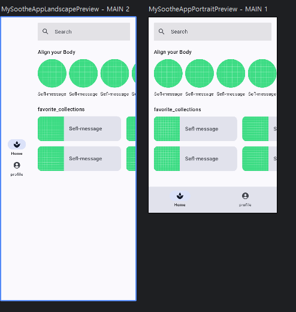
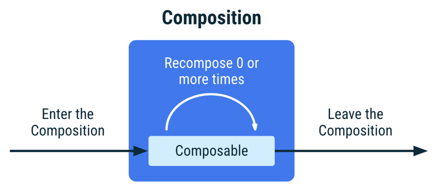

# wd40-compose

## 상태
> 상태는 존재하고, 이벤트는 발생한다
- 앱 상태로 UI에 표시할 항목에 관한 설명이 제공되고, 이벤트 메커니즘을 통해 상태가 변경되고, UI도 변경된다
- 이벤트는 어떤 일이 발생했다고 프로그램 일부에 알림. 


### UI 업데이트 루프

- 이벤트 : 사용자 또는 프로그램의 다른 부분에 의해 생성됨
- 상태 업데이트 : 이벤트 헨들러가 UI에서 사용하는 상태를 변경
- 상태 표시 : 새로운 상태를 표시하도록 UI가 업데이트 됨

### 컴포지션
- 컴포즈 앱은 구성 가능한 함수를 호출하여 데이터를 UI로 변환
- 컴포저블을 실행할 때 Compose에서 빌드한 UI에 관한 설명을 컴포지션 이라고 함
- 상태가 변경되면 컴포즈는 영향을 받는 구성 가능한 함수를 새 상태로 다시 실행
  - 그러면 리컴포지션이라는 업데이트가 된 UI가 만들어짐
  - 또한 컴포즈는 데이터가 변경된 구성요소만 재구성하고, 
  - 영향을 받지 않는 구성 요소는 건너뛰도록 개별 컴포저블에 필요한 데이터를 확인

> 컴포지션 : 컴포저블을 실행할 때 Jetpack Compose에서 빌드한 UI에 관한 설명

> 초기 컴포지션 : 처음 컴포저블을 실행하여 컴포지션을 만듦

> 리컴포지션 : 데이터가 변경될 때 컴포지션을 업데이트 하기 위해 컴포저블을 다시 실행하는 것

- 컴포즈가 추적할 상태를 알아야 한다. 그래야 업데이트를 받을 때 리컴포지션을 예약이 가능해짐. 
  - '쓰기' (상태 변경) 뿐만 아니라 '읽기' 또한 추적하여 실행
  - value 속성을 읽는 각 컴포저블을 추적하고, 그 value가 변경되면 리컴포지션을 트리거
  - `mutableStateOf` 함수를 사용하여 관찰 가능한 `MutableState`를 만들 수 있음
  - 초기값을 State객체에 래핑된 매개변수로 수신한 다음, value의 값을 관찰 가능한 상태로 만듦 
  
### 상태 기반 UI
- 컴포즈는 선언형 UI 프레임워크
- 상태가 변경될 때 UI 구성요소를 삭제하거나 공개 상태를 변경하는 대신 특정 상태의 조건에서 UI가 어떻게 존재하는지를 설명

- 뷰를 수동으로 업데이트 하지 않아도 됨. 새 상태에 따라 뷰를 자동으로 업데이트 됨

### 컴포지션의 Remember
- 컴포지션에 객체를 저장하고, remember가 호출되는 소스 위치가 리컴포지션 중에 다시 호출되지 않으면 객체를 삭제

### Compose에서 상태 복원
- Activity는 구성변경 시 (다크모드 전환, 가로세로 모드) 재생됭 됨. == 저장된 상태가 사라짐
- remember를 사용하면 리컴포지션간에 상태를 유지하는 데 도움이 되지만. 구성 변경 간에는 유지되지 않음.
- `remember`대신 `rememberSaveable`를 사용해야 함
- `rememberSaveable`은 Bundle에 저장할 수 있는 모든 값을 자동으로 저장. 

### 상태 호이스팅
- remember를 사용하여 객체를 저장하는 컴포저블에는 내부 상태가 포함되며 이는 컴포저블을 스테이트풀(stateful)로 만듦
- 호출자가 상태를 제어할 필요가 없고 상태를 직접 관리하지 않아도 상태를 사용할 수 있는 경우에 유용
- 내부 상태를 갖는 컴포저블은 재사용 가능성이 적고 테스트하기가 더 어려운 경향이 있음
- 상태를 보유하지 않는 컴포저블을 스테이리스(Stateless) 컴포저블이라고 함
- 상태 호이스팅을 사용하면 스테이트리스 컴포저블을 만들 수 있음

> 컴포즈에서 상태 호이스팅은 컴포저블을 스테이트리스로 만들기 위해 상태를 컴포저블의 호출자로 옮기는 패턴
 
> Jetpack Compose에서 상태 호이스팅을 위한 일반적 패턴은 상태 변수를 다음 두개의 매개변수로 바꾸는 것
- `value : T - 표시할 현재 값`
  - 컴포저블이 표시할 현재 상태값을 외부에서 전달 받음
  - 상태를 내부에서 관리하지 않기 때문에 컴포저블은 상태를 직접 변경하지 않음
- `onValueChange :(T) -> Unit - 값이 새 값 T로 변경되도록 요청하는 이벤트`
  - 상태가 변경될 때 호출되는 콜백 함수
  - 컴포저블 내부에서 사용자 입력이나 이벤트로 인해 상태 변경이 필요하면 호출자(부모 컴포저블)가 상태를 관리

- 상태가 내려가고 이벤트가 올라가는 패턴을 단방향 데이터 흐름(UDF)이라고 하며, 상태 호이스팅은 이 아키텍처를 컴포즈에서 구현하는 방법
  - 중요 속성
    - 단일 소스 저장소 : 상태를 복제하는 대신 옮겼기 때문에 소스 저장소가 하나만 있는 게 버그 방지에 도움됨
    - 공유 가능함 : 끌어올린 상태를 여러 컴포저블과 공유할 수 있음
    - 가로채기 가능 : 스테이트리스 컴포저블의 호출자는 상태를 변경하기 전에 이벤트를 무시할지 수정할지 결정
    - 분리됨 : 구성 가능한 스테이트리스 함수의 상태는 어디에든 저장할 수 있음

- Stateful vs Stateless
  - Stateful
    - 시간이 지남에 따라 변할 수 있는 상태를 소유하는 컴포저블
    - 실제 앱에서는 모든 컴포저블을 스테이트리스로 하는 것은 어려움. 컴포저블이 가능한 적게 상태를 소유하고, 
    - 적절한 경우에 컴포저블의 API에 상태를 노출하여 상태를 끌어올릴 수 있도록 컴포저블을 디자인해야 함
  - Stateless
    - 구성 가능한 함수에서 모든 상태를 추출할 수 있는 경우 결과로 생성되는 구성 가능한 함수를 Stateless라고 함
    - 상태를 소유하지 않는 컴포저블. 새 상태를 보유하거나 정의하거나 수정하지 않음

- 상태를 끌어올릴 때 상태의 이동 위치를 쉽게 파악할 수 있는 세 가지 규칙
  1. 상태는 적어도 그 상태를 사용하는 모든 컴포저블의 가장 낮은 공통 상위 요소로 끌어올려야 함 (읽기)
  2. 상태는 최소한 변경될 수 있는 가장 높은 수준으로 끌어올려야 함 (쓰기)
  3. 두 상태가 동일한 이벤트에 대한 응답으로 변경되는 경우 두 상태는 동일한 수준으로 끌어올려야 함
- 이러한 규칙에서 요구하는 것보다 더 높은 수준으로 상태를 끌어올릴 수 있음. 
- 하지만 상태를 충분히 높은 수준으로 끌어올리지 않으면, 단방향 데이터 흐름을 따르기가 어렵거나 불가능해짐.

- 끌어올린 상태는 공유할 수 있으므로. 불필요한 리컴포지션을 방지하고 재사용성을 높이려면 컴포저블에 필요한 상태만 전달해야 한다

> 컴포저블 디자인 권장사항은 필요한 매개변수만 전달하는 것

- 컴포즈에서 상태 호이스팅 패턴의 일반적인 구조
  - Stateless 컴포저블
  ```kt
  @Composeable
  fun ComponentName(value: T, onValueChange: (T) -> Unit) {
    // UI는 전달 받는 상태 value를 표시하고
    // 이벤트 발생 시 onValueChange를 호출
  }
  ```
  - Stateful 호출자
  ```kt
  @Composable
  fun Parent() {
    var state by remember { mutableStateOf(initialValue) }
    ComponentName(value = state, onValueChange = { newValue -> state = newValue} )
  }
  ```
  - 컴포저블의 책임 분리 : 상태 표시와 상태 관리 로직을 분리
  - 재사용성 증가
  - 상태 동기화 용이 : 여러 컴포저블이 동일 상태를 공유 가능

#### MutableList
- mutableStateOf 함수는 MutableState<T> 유형의 객체를 반환
- mutableStateListOf 및 toMutableStateList 함수는 SnapshotStateList<T> 유형의 객체를 반환
- 관찰 가능한 MutableList를 정의 하기위해서 `toMutableStateList()`를 사용하면 변경 가능하거나, 변경 불가능한 초기 Collection (ex. List) 에서 관찰 가능한 MutablesList를 만들 수 있음

#### ViewModel의 상태
- UI 상태와 앱의 다른 레이어에 있는 비즈니스 로직에 대한 액세스 권한을 제공
- 또한 ViewModel은 구성 변경 후에도 유지되므로 컴포지션보다 전체 기간이 더 긺
- *ViewModel은 컴포지션의 일부가 아님. 메모리 누수가 발생할 수 있으므로 컴포저블에서 만든 상태(ex.기억된 값)를 보유하면 안됨
- UI로직과 비즈니스 로직을 UI상태와 분리하여 ViewModel에 이전해서 사용
- viewModel 인스턴스를 다른 컴포저블에 전달하는 것은 좋지않음
- 필요한 데이터와 필수 로직을 실행하는 함수만 매개변수로 전달해야 함

---
### 추가

#### 선언
- var : 변경 가능
- val : 변경 불가

#### 단축키
- Android 스튜디오의 편집기 영역에 WC를 입력하면 추천 상자가 열립니다. Enter를 누르고 첫 번째 옵션을 선택하면 Column 템플릿이 표시되고 이를 사용하면 됩니다

#### data class
- 데이터 저장을 위해 사용
- 불변성을 강조하며, 값 중심의 클래스 정의에 적합
- 자동 생성되는 함수 
  - equals()
  - hashCode()
  - toString()
  - copy()
  - 구조 분해 지원 `val (id, label) = Task` 