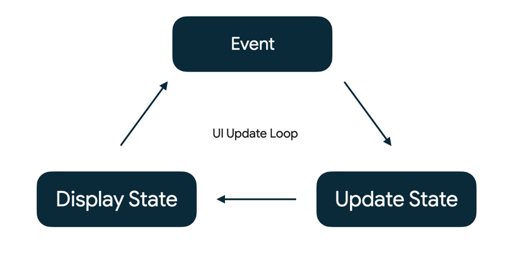

# wd40-compose

디자인 구현

[Codelab Page](https://developer.android.com/codelabs/jetpack-compose-layouts?authuser=1&hl=ko&continue=https%3A%2F%2Fdeveloper.android.com%2Fcourses%2Fpathways%2Fjetpack-compose-for-android-developers-1%3Fhl%3Dko%26authuser%3D1%23codelab-https%3A%2F%2Fdeveloper.android.com%2Fcodelabs%2Fjetpack-compose-layouts#14)

